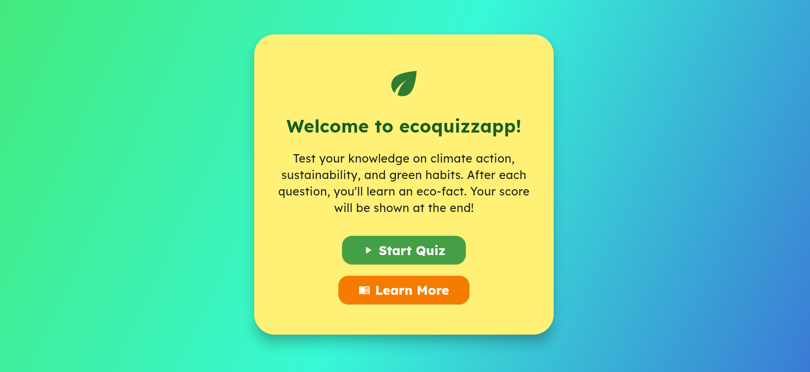

# 🌍 ecoquizzapp

**ecoquizzapp** is a lightweight Flutter app built to support **SDG 13: Climate Action** by educating users through a fun, interactive environmental quiz. It gives users instant feedback and eco-facts after each question, helping spread climate awareness in a simple and engaging way.

---

## 🌱 Features

- ✅ **Environmental Quiz**  
  Answer multiple-choice questions on climate action, sustainability, and green habits.

- 📚 **Learn Eco-Facts**  
  After answering a question, learn a relevant and interesting fact.

- 🧮 **Final Score Display**  
  Get your total score at the end of the quiz.

- 📘 **Optional Learning Page**  
  Browse more facts about climate and sustainability anytime.

- 📱 **Simple UI**  
  Clean, intuitive design optimized for mobile.

---

## App Link 
- https://eco-quizz-app-c2vj.vercel.app/

## 📱 App Screenshot




---

## 🧭 Pages Overview

- **Home Page**
  - Welcome message, a "Start Quiz" and "Learn More" button.

- **Quiz Page**
  - Displays questions, answer options, and eco-facts after each answer.

- **Result Page**
  - Displays final score and option to retry or view learning content.

- **Learn Page **
  - Scrollable list of eco-facts and green tips.

---

## 🚀 Getting Started

- Follow these steps to set up and run the app locally.

### 1. Clone the Repository

```bash
git clone https://github.com/yourusername/ecoquizzapp.git
cd ecoquizzapp
```

### 2. Install Dependencies
```bash
flutter pub get
```
### 3. Run the App
```bash
flutter run
```

### 📂 Project Structure

lib/
├── main.dart                # App entry point
├── pages/
│   ├── home_page.dart       # Home page with welcome and instructions
│   ├── quiz_page.dart       # Quiz logic, questions, and explanations
│   ├── result_page.dart     # Final score and restart option
│   └── learn_page.dart      # (Optional) Extra facts and green tips
├── assets/
│   └── quiz_data.json       # (Optional) JSON file for external quiz content
├── screenshots/
│   └── app_preview.png      # Screenshot placeholder
└── [pubspec.yaml](http://_vscodecontentref_/0)             # Dependency and asset declarations


### 💚 Why This Matters
ecoquizzapp promotes environmental education and supports Sustainable Development Goal 13 by making climate knowledge accessible and fun — especially for youth and schools.


